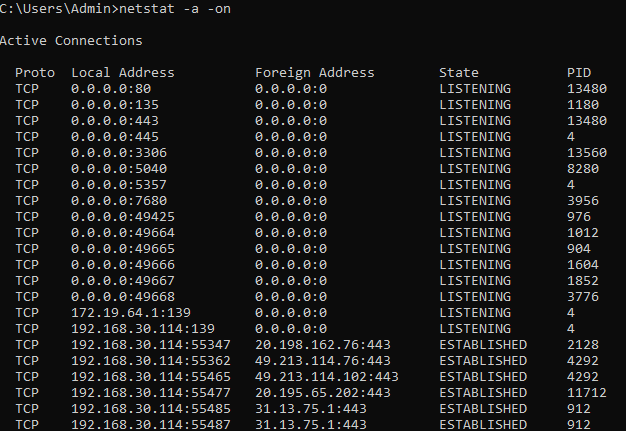
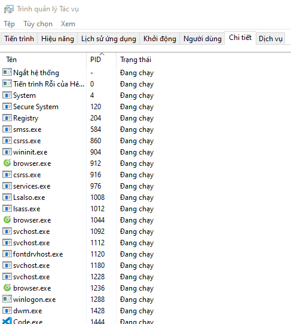

# Tổng hợp 1 số lỗi thường gặp khi sử dụng Xampp và Codeigniter
### 1 - The term 'php' is not recognized as the name of a cmdlet, function, script file, or operable program. Check the spelling of the name, or if a path was included, verify that the path is correct and try again
- Vào thư mục `xampp\php` tương ứng với vị trí lưu khi cài đặt.
- Copy địa chỉ thư mục. VD : `D:\xampp\php`.
- Vào `Cài đặt > Hệ thống > Giới thiệu`, tại mục `Cài đặt liên quan` chọn `Thiết đặt hệ thống chuyên sâu`.
- Chọn `Environment Variables`. Trong Listview `System variables` nháy đúp chuột vào `Path`.
- Chọn `New` và nhập địa chỉ thư mục vào sau đó nhấn `OK` để kết thúc.
- Bật `Command Prompt` và nhập `php --version` để kiểm tra.

### 2 - The requested PHP extension intl is missing from your system.
#### - The framework needs the following extension(s) installed and loaded: intl
- Tìm thư mục `php` trong thư mục đã chọn khi cài đặt **XAMPP**. VD : `D:\xampp\php`.
- Mở file `php.ini` trong thư mục và tìm kiếm `;extension=intl`.
- Xóa dấu `;` phía trước và lưu lại --> `extension=intl`

### 3 - Mở báo lỗi code cho lập trình viên trong Codeigniter
- Truy cập `app/Config/Boot/production.php`. 
- Sửa `ini_set('display_errors', '0');` thành `ini_set('display_errors', '1');`.

### 4 - Port 80 in use by "Unable to open process" with PID 4! Apache WILL NOT start without the configured ports free! You need to uninstall/disable/reconfigure the blocking application or reconfigure Apache and the Control Panel to listen on a different port.
> Port 80 đang được 1 phần mềm nào khác sử dụng nên không thể mở. Cần tắt phần mềm đó đi hoặc cấu hình lại Port mặc định cho XAMPP.
#### Cách 1 - Tắt phần mềm đang chạy
- Mở `Command Prompt` và gõ lệnh `netstat -a -on`.
- Sau khi thực hiện lệnh trên sẽ hiển thị ra danh sách thông tin nhưng chỉ cần quan tâm tới 2 cột `Local Address` và `PID` ( Như hình )

>
>    - ***Local Address*** : Địa chỉ bao gồm `IP` : `PORT`
>    - ***PID*** : ***PID*** phần mềm đang sử dụng ***Local Address*** tương ứng.
>
- Mở `Task Manager` và chọn mục `Chi tiết` để hiển thị chi tiết những phần mềm đang chạy ( Như hình )

- Tìm `PID` đã tìm được trong **Task Manager**. Nhấp chuột phải và chọn `Kết thúc tác vụ`.